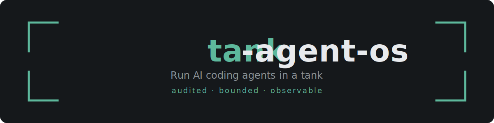
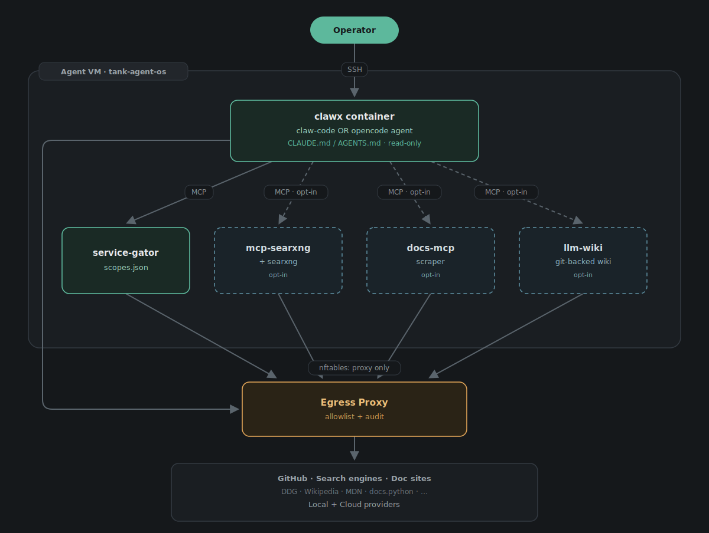

<p align="center">
  
</p>

<p align="center">
  
  
  
</p>

Run an autonomous AI coding agent under controls it cannot disable. An autonomous agent decides
at runtime which services to call and which files to read, so containment has to be a property
of the *whole stack*, not a single control. Every outbound packet is forced through an audited
egress proxy, OS-level nftables confine the agent's UID, and a root-owned instruction file
hardens against prompt injection — all enforced by the OS, not by the agent's cooperation.

**tank-agent-os** is a Fedora [bootc](https://bootc-dev.github.io/bootc/) image that ships one
autonomous coding agent — **opencode** or **claw-code** — inside a hardened, rootless-Podman
appliance. bootc turns a container image into a bootable, updateable Linux OS; exactly one agent
runtime ships per image, chosen at build time via `AGENT_KIND` — no runtime switching, no
runtime updates. Run the agent in a tank — audited, bounded, observable.

## Architecture



## Features

| Feature | What it does | Docs |
|---|---|---|
| Two pinned agent runtimes | opencode (default) or claw-code — one per image, no runtime switching or updates | [build.md](docs/build.md) |
| Audited egress proxy | every outbound packet forced through an allowlisted, logged proxy on a separate host | [security.md](docs/security.md) |
| OS-level network lockdown | nftables confine the agent UID to the proxy; a deny-all baseline applies even with no proxy configured | [security.md](docs/security.md) |
| Prompt-injection hardening | a root-owned, read-only instruction file sets a data-not-commands trust hierarchy | [security.md](docs/security.md) |
| Mediated external access | service-gator gates GitHub / GitLab / JIRA behind a per-repo `scopes.json` allowlist | [service-gator.md](docs/service-gator.md) |
| Self-hosted web search | a SearXNG + mcp-searxng pair — no cloud API key, no external search-provider trust anchor | [web-search.md](docs/web-search.md) |
| Docs-lookup MCP | scrapes and indexes developer documentation, served to the agent over MCP | [docs-lookup.md](docs/docs-lookup.md) |
| LLM-Wiki MCP | an agent-curated knowledge base — the agent distils sources into linked notes it grows and reuses across sessions; a complement to RAG | [llm-wiki.md](docs/llm-wiki.md) |
| Skill drop-in | drop a `SKILL.md` folder in one host directory — live next session, no image rebuild | [skills.md](docs/skills.md) |
| Persistent agent memory | build-time opt-in; off by default — persistent memory is a prompt-injection-persistence surface | [memory.md](docs/memory.md) |
| MCP adoption gate | every new MCP server ships with a written security audit in [`audits/`](audits/) | [security.md](docs/security.md) |

## Security

tank-agent-os treats agent security as a property of the whole stack. Three load-bearing controls:

- **Network containment** — the agent container has no `CAP_NET_ADMIN`; host nftables block every
  outbound packet from the agent UID except to the egress proxy. Direct calls to GitHub or any
  non-allowlisted host are rejected before the TLS handshake.
- **Mediated access** — the agent reaches external services only through service-gator, which
  enforces a per-repository, per-permission `scopes.json` allowlist. A compromised agent can reach
  only what the allowlist explicitly permits.
- **Prompt-injection hardening** — a root-owned, read-only instruction file is loaded into the
  system prompt on every run and directs the agent to treat workspace content as data, not
  commands.

The agent VM alone cannot produce a trusted network audit trail — the separate proxy host is the
trust boundary. Full threat model, capability table and trust-boundary diagram:
[docs/security.md](docs/security.md).

## Runtime config

Provider config is runtime input — never baked into the image. Supply it via `AGENT_*` environment
variables, `AGENT_CONFIG`, `/run/agent/config.env`, or `~/.clawx/agent.env`:

```env
AGENT_PROVIDER=ollama
AGENT_BASE_URL=http://ollama.example.internal:11434/v1
AGENT_MODEL=replace-with-ollama-model
```

## Get started

1. [Build the image](docs/build.md)
2. [Import into Proxmox](docs/proxmox-import.md)
3. [Configure login access](docs/provisioning.md)
4. **[Get the agent running after first boot](docs/first-boot.md)**
5. [Use the CLI wrapper](docs/cli.md) · [configure model providers](docs/model-providers.md) · [configure service-gator](docs/service-gator.md)
6. Optional MCPs: [web search](docs/web-search.md) · [docs lookup](docs/docs-lookup.md) · [LLM-Wiki](docs/llm-wiki.md)
7. Extend: [add skills](docs/skills.md) · [persistent memory](docs/memory.md)
8. Understand the [security model](docs/security.md)

For bootc concepts and day-2 operations, see the upstream [bootc documentation](https://bootc-dev.github.io/bootc/).

## Acknowledgements

- **[LobsterTrap/tank-os](https://github.com/LobsterTrap/tank-os)** — the appliance architecture this repo forks: Fedora bootc, rootless Podman Quadlets, cloud-init provisioning, service-gator integration, the rootless secrets model.
- **[anomalyco/opencode](https://github.com/anomalyco/opencode)** — the default agent runtime, downloaded from upstream releases at build time and pinned by tarball SHA-256.
- **[ultraworkers/claw-code](https://github.com/ultraworkers/claw-code)** — the experimental second runtime, compiled from a pinned commit with local patches, output binary SHA-256-pinned.

## License

[MIT](LICENSE) © 2026 np6126 · portions © Lobster Trap
